# AC Runtime Compiler: Comprehensive Execution and Logic Flow Guide

The `@autocode-ts/ac-runtime-compiler` is a high-performance, build-time compilation engine. It transforms declarative, `@AcElement`-decorated TypeScript source files into native, self-contained Web Components. By moving the template parsing, AST transformation, expression prefixing, and binding code generation to build time, the runtime overhead is reduced to Proxy-based change detection and direct DOM updates.

This document describes the compiler's modular pipeline, its internal orchestration logic, and how compiler-generated code interacts with `AcElementRenderer` subclasses and `AcRuntimeElement` wrappers at runtime.

---

## 1. High-Level Architecture Overview

At a high level, the compiler processes input source files and outputs valid TypeScript (or JavaScript) that defines self-contained immediately-invoked function expressions (IIFE). 

```
┌─────────────────────────┐      Build-Time Compilation      ┌─────────────────────────────────┐
│  TypeScript Source file │ ───────────────────────────────> │ Scoped IIFE Native Web Element  │
│  - @AcElement Component │                                  │ - AcElementRenderer Subclasses  │
│  - Reactive Properties  │                                  │ - Proxy-Backed Properties       │
│  - HTML Template Syntax │                                  │ - Direct-DOM-Update Listeners   │
└─────────────────────────┘                                  └─────────────────────────────────┘
```

The compilation process is managed by [ComponentCompiler](file:///f:/Packages/AutoCode/Github/autocode-typescript/packages/runtime/ac-runtime-compiler/src/lib/component-compiler.ts), which acts as a central orchestrator. It parses the files, isolates components, resolves external files, delegates template and expression analysis to specialized modules, and then re-assembles the output.

---

## 2. Visual Execution Flow Graph

The flowchart below visualizes the complete compiler pipeline, from the moment a raw TypeScript file is read to the output of the compiled, IIFE-wrapped native Web Component.

```mermaid
graph TB
    %% Styling and Definitions
    classDef stage fill:#1e293b,stroke:#3b82f6,stroke-width:2px,color:#f8fafc;
    classDef process fill:#0f172a,stroke:#64748b,stroke-width:1px,color:#e2e8f0;
    classDef data fill:#022c22,stroke:#10b981,stroke-width:2px,color:#34d399;
    classDef output fill:#1e1b4b,stroke:#818cf8,stroke-width:2px,color:#c7d2fe;

    subgraph INPUT ["1. Input Phase"]
        Source[/"Raw TypeScript Code<br/>(.ts Source File)"/]:::data
    end

    subgraph PHASE1 ["2. Parsing & Isolation Phase"]
        Parse["Parse Source into TypeScript AST<br/>(ts.createSourceFile)"]:::process
        Filter{"Is Class Decorated<br/>with @AcElement?"}:::process
        NonComponent["Passthrough Statement<br/>(Imports, Exports, Utilities)"]:::process
    end

    subgraph PHASE2 ["3. Extract Metadata & Resolve"]
        Metadata["Extract Decorator Metadata<br/>- selector<br/>- template / templateUrl<br/>- styles / styleUrls"]:::process
        FSResolve["Resolve External Files from Disk<br/>(fs.readFileSync)"]:::process
    end

    subgraph PHASE3 ["4. Template Compilation"]
        HtmlParse["Parse Template HTML<br/>(htmlparser2 Parser)"]:::process
        TreeWalk["Walk DOM Tree & Extract Bindings<br/>(Text, Event, Prop, Class, Model...)"]:::process
        SubCompile{"Structural Directive?<br/>(ac:if / ac:for)"}:::process
        Recurse["Spawn Template Sub-Compiler<br/>& Return Comment Placeholders"]:::process
        RefGen["Generate 8-char Hex ac-ref IDs<br/>for Bound Elements"]:::process
        TemplateOut["Output:<br/>- Cleaned, Static HTML<br/>- Binding Descriptors Array<br/>- Reference Map (idMap)"]:::data
    end

    subgraph PHASE4 ["5. AST Analysis & Transformation"]
        Classify["Classify Class Members:<br/>- Inputs (@AcInput)<br/>- Outputs (@AcOutput)<br/>- ViewChildren (@AcViewChild)<br/>- Reactive Properties (Used in Template)<br/>- Plain Fields (Static Properties)"]:::process
        Prefixer["Expression Prefixer:<br/>Rewrite template expression ASTs<br/>(Prepend 'this.' to component properties)"]:::process
    end

    subgraph PHASE5 ["6. Code Generation & IIFE Assembly"]
        PropInit["Generate Property Initializers<br/>(this as any.prop = init)"]:::process
        OutInit["Generate CustomEvent Emitters<br/>for @AcOutputs"]:::process
        DefineViewChildren["Generate QuerySelector Getters<br/>for @AcViewChild and Template #Refs"]:::process
        GenBindings["Generate Runtime Binding Effects<br/>(createEffect, addEventListener)"]:::process
        GenSignals["Generate Signal Backing Setup<br/>(createSignal and Object.defineProperty)"]:::process
        Wrapper["Construct Native HTMLElement Wrapper<br/>- connectedCallback (render & acOnInit)<br/>- disconnectedCallback (cleanup & acOnDestroy)<br/>- observedAttributes & attributeChangedCallback"]:::process
        IIFE["Assemble IIFE Structure<br/>- Local Signals System<br/>- Inner Reactive Class<br/>- HTMLElement wrapper<br/>- customElements.define()"]:::process
    end

    subgraph OUTPUT_PHASE ["7. Output Phase"]
        FinalCode[/"Compiled Web Component Code<br/>(Imports + Scoped IIFE)"/]:::output
    end

    %% Flow Connections
    Source --> Parse
    Parse --> Filter
    Filter -- No --> NonComponent
    Filter -- Yes --> Metadata
    Metadata --> FSResolve
    FSResolve --> HtmlParse
    HtmlParse --> TreeWalk
    TreeWalk --> SubCompile
    SubCompile -- Yes --> Recurse
    Recurse --> TreeWalk
    SubCompile -- No --> RefGen
    RefGen --> TemplateOut
    TemplateOut --> Classify
    Classify --> Prefixer
    Prefixer --> PropInit
    PropInit --> OutInit
    OutInit --> DefineViewChildren
    DefineViewChildren --> GenBindings
    GenBindings --> GenSignals
    GenSignals --> Wrapper
    Wrapper --> IIFE
    NonComponent --> IIFE
    IIFE --> FinalCode

    %% Styling Application
    class Source,TemplateOut data;
    class Parse,Filter,NonComponent,Metadata,FSResolve,HtmlParse,TreeWalk,SubCompile,Recurse,RefGen,Classify,Prefixer,PropInit,OutInit,DefineViewChildren,GenBindings,GenSignals,Wrapper,IIFE stage;
    class FinalCode output;
```



---

## 3. Step-by-Step Compilation Phases

Let's break down the execution logic of the [ComponentCompiler](file:///f:/Packages/AutoCode/Github/autocode-typescript/packages/runtime/ac-runtime-compiler/src/lib/component-compiler.ts) and its dependencies into distinct chronological phases.

### Phase 1: Source Code Parsing & Categorization
When [ComponentCompiler.compile()](file:///f:/Packages/AutoCode/Github/autocode-typescript/packages/runtime/ac-runtime-compiler/src/lib/component-compiler.ts#L87-L171) is executed:
1. The compiler parses the raw TypeScript source into a TypeScript Abstract Syntax Tree (AST) via `ts.createSourceFile` with the latest language targets.
2. It iterates through the top-level statements of the file:
   - **Component Classes**: Identifies class declarations that have the `@AcElement` decorator. It extracts their AST nodes and decorator details and marks them for compilation.
   - **Imports & Exports**: Collects all module imports and exports. Relative paths (like `./utils`) are converted to fully qualified absolute paths (or run through custom Vite/bundler module resolvers).
   - **Trailing & Pre-Component Code**: Collects non-component declarations, global variables, utility functions, and imports. These are classified and held to be printed before or after the generated components.

### Phase 2: Metadata Extraction & Resource Resolution
For each component class found:
1. **Metadata Parsing**: The compiler extracts metadata fields from the `@AcElement(...)` decorator call:
   - `selector`: The custom element registration tag name (e.g. `'my-counter'`).
   - `template`/`templateUrl`: The string literal HTML or the file system path of the HTML template.
   - `styles`/`styleUrls`: Inline CSS styling blocks or external CSS/SASS file system paths.
2. **File Resolution**: If external URLs are specified (`templateUrl`, `styleUrls`), the compiler resolves them relative to the current file path and reads them directly from disk via Node's `fs.readFileSync`.

### Phase 3: Template Compilation (`TemplateCompiler`)
The template string is compiled via the [TemplateCompiler](file:///f:/Packages/AutoCode/Github/autocode-typescript/packages/runtime/ac-runtime-compiler/src/lib/template-compiler.ts), a stateless parser:
1. **DOM Tree Creation**: The HTML string is converted into a DOM tree using `htmlparser2` with camelCase attribute preservation enabled.
2. **Tree Walk & Binding Extraction**: The compiler recursively walks every node in the DOM tree, identifying AC-specific reactivity syntax:
   - **Text Interpolations**: Identifies `{{ expression }}` markers. The text node is replaced with a clean `<span ac-ref="ac-xxxxxxxx"></span>` placeholder, and a `'text'` binding is registered.
   - **Property Bindings**: Matches `[property]="expr"` attributes and creates a `'property'` binding.
   - **Event Bindings**: Matches `(event)="handler()"` attributes and creates an `'event'` binding.
   - **Directives & Toggles**: Matches special attributes like `ac:class:name`, `ac:style:prop`, `ac:model` (two-way bindings), and `ac:bind:attr`.
   - **Template References**: Matches `#refName` tags, mapping them to the element's unique runtime ID.
3. **Reference Generation**: Every HTML element that carries a binding is assigned a unique, random 8-character hex attribute `ac-ref="ac-xxxxxxxx"`. This stable ID allows the runtime renderer to target the element directly in the DOM tree without complex virtual DOM selectors.
4. **Structural Directives (`ac:if`, `ac:for`)**:
   - When the compiler encounters an `ac:if` or `ac:for` directive, it isolates the element's template.
   - It **spawns a template sub-compiler** to recursively compile the child tree.
   - The compiled child tree's HTML is stored inside the binding descriptor as `template` and its inner bindings are saved as `childBindings`.
   - The original element is removed and replaced by a stable HTML comment placeholder `<!--ac-if-xxxxxxxx-->` or `<!--ac-for-xxxxxxxx-->`.
5. **Output**: The phase returns the cleaned, static HTML markup (containing ref IDs and comment placeholders), an array of structured `Binding` descriptors, and a mapping of `#ref` strings to hex IDs (`idMap`).

### Phase 4: AST Member Classification & Expression Prefixing
Back inside the component compiler, the component class body is analyzed using TypeScript AST helpers:
1. **Member Classification**:
   - **Inputs (`@AcInput()`)**: Gathered into the inputs list (propagated as HTML attributes).
   - **Outputs (`@AcOutput()`)**: Registered as event emitters that bubble `CustomEvent` objects.
   - **ViewChildren (`@AcViewChild()`)**: Identified and registered to query DOM element refs in the template.
   - **Reactive Properties**: Classifies class properties as reactive if they are either marked as `@AcInput` or if their identifier is extracted as "used" within the template bindings.
   - **Plain Properties & Methods**: Methods and accessors are extracted verbatim as code strings to be copied directly to the compiled class.
2. **Expression Prefixing (`expression-prefixer`)**:
   - Since template expressions are written as bare identifiers (e.g. `count > 10`), they must be rewritten to target the class instance at runtime (e.g. `this.count > 10`).
   - The [expression-prefixer](file:///f:/Packages/AutoCode/Github/autocode-typescript/packages/runtime/ac-runtime-compiler/src/lib/expression-prefixer.ts) uses a `ts.transform` AST visitor to walk the expression tree.
   - It identifies bare identifiers and prefixes them with `this.`.
   - **Crucially**, it skips prefixing for global web API variables (like `Math`, `JSON`, `window`, etc.), imports/variables declared at the file level (`topLevelVars`), and local variables declared inside loops (`localVars` like `item` or `i` from `ac:for="item of items"`).

### Phase 5: Code Generation & IIFE Assembly
The final phase assembly is handled by the [code-generator](file:///f:/Packages/AutoCode/Github/autocode-typescript/packages/runtime/ac-runtime-compiler/src/lib/code-generator.ts):
1. **Renderer Subclass Generation**: For each block scope (root, `ac:if`, `ac:for`), generates a class extending `AcElementRenderer` with:
   - `createNodes()`: Creates DOM nodes from a statically cached `DocumentFragment` (`templateFragment`), caches element references via `querySelector('[ac-ref="..."]')`, and registers compiled event listeners.
   - `executeChangeListener()`: Contains the compiled change detection logic. For each binding, evaluates the expression using the component context (`ctx`), compares with cached values, and updates the DOM directly.
2. **Event & Model Compilation**: Event handlers and model write-backs are compiled to **direct code** at build time:
   - Event: `ctx.handleClick($event)` — no runtime eval
   - Model: `ctx.name = el.value` — no runtime eval
   - Pipes: `__acPipe(ctx.amount, 'currency')` — transformed at compile time
3. **HTMLElement Wrapper Assembly**:
   - Generates a wrapper class extending `AcRuntimeElement`.
   - Instantiates the user's component class and wraps it with `makeReactive()` (Proxy-based deep change tracking).
   - Wires up `elementRenderer` (root `AcElementRenderer` subclass), `propertyListeners` (compile-time binding map), and `propertyToListenForChanges`.
   - Maps observed attributes to `@AcInput()` component properties.
   - Implements `connectedCallback()` which inserts scoped CSS with reference counting.
   - Implements `disconnectedCallback()` which removes scoped CSS when reference count drops to zero.
4. **Reassembly**: The imports (including `AcRuntimeElement`, `AcElementRenderer`, `AcRuntimeElementEvent`, `__acPipe`), pre-component statements, IIFE wrapper, custom element registration `customElements.define(...)`, and trailing code are joined into the final output.

---

## 4. Compilation vs. Runtime Mapping

To understand how build-time compilation relates directly to runtime DOM and state execution, let's examine a concrete compilation scenario.

### The Input Template
```html
<div [class.active]="isActive" (click)="toggleActive()">
  <span>Counter: {{count}}</span>
  <button [disabled]="count >= 10">Increment</button>
</div>
```

### The Output Compiled Runtime Mechanics

Here is the exact structural conversion that takes place between compilation and execution:

| Compiler (Build-Time Analysis) | Compiled Output (Renderer Subclass Code) | Runtime Behavior (Proxy & DOM) |
| :--- | :--- | :--- |
| **Static HTML & Ref Generation** | `template.innerHTML = \`<div ac-ref="e10f">...</div>\``<br/>`this.el$e10f = fragment.querySelector('[ac-ref="e10f"]')` | Static HTML is set once into a cached `DocumentFragment`. Element references are resolved via `querySelector` during `createNodes()` and cached as instance properties. |
| **`[class.active]="isActive"`** | `const newValue = ctx.isActive;`<br/>`el.classList.add/remove('active')` | Inside `executeChangeListener()`, the expression is evaluated against the Proxy-wrapped component instance. The Proxy's `set` trap triggers `executeChangeListener` whenever `isActive` changes. |
| **`(click)="toggleActive()"`** | `el.addEventListener('click', (event) => {`<br/>`  const ctx = this.rootElement.acRuntimeInstance;`<br/>`  ctx.toggleActive();`<br/>`});` | An event listener is attached during `createNodes()`. Clicking the element directly calls the compiled method on the component instance. No runtime eval — fully compiled at build time. |
| **`{{count}}` (Text Interpolation)** | `const newValue = ctx.count;`<br/>`el.textContent = String(newValue);` | The Proxy's `set` trap on `count` triggers `executeChangeListener` which compares cached vs. new values and updates `textContent` only when changed. |
| **`[disabled]="count >= 10"`** | `const newValue = ctx.count >= 10;`<br/>`el['disabled'] = newValue;` | Same Proxy-driven mechanism. The compiled expression `ctx.count >= 10` is evaluated directly (no `new Function`). |

---

## 5. Detailed Logic Flow of Key Binding Engines

Let's look at the generated runtime patterns for some of the most critical structural and complex directive bindings.

### A. Two-way Data Binding (`ac:model`)
The code generator compiles `ac:model` into two-way data flows:
* **Data-to-DOM Flow**: Inside `executeChangeListener()`, the element's `value` property is set from the component property.
* **DOM-to-Data Flow**: During `createNodes()`, event listeners for `input` and `change` are attached. These write back to the component property using **direct compiled code** (no `evaluateExpression`).

```typescript
// Compiled ac:model="quantity" on an input field:

// In executeChangeListener():
const newValue = ctx.quantity;
if (this.el$m101) (this.el$m101 as any).value = newValue;

// In createNodes():
const ctx = this.rootElement.acRuntimeInstance;
const el = this.el$m101 as any;
const __modelUpdate = () => { ctx.quantity = el.value; };
el.addEventListener('input', __modelUpdate);
el.addEventListener('change', __modelUpdate);
```

---

### B. Conditional Rendering (`ac:if`)
The [generateIfBinding](file:///f:/Packages/AutoCode/Github/autocode-typescript/packages/runtime/ac-runtime-compiler/src/lib/bindings/if-binding.ts) uses a stable comment placeholder. It mounts and unmounts DOM subtrees dynamically using standard DOM insertions, and executes nested child bindings.

```typescript
(function(this: any) { 
  let currentNodes: any[] = []; 
  // Find the comment insertion point in the DOM
  const placeholder = findComment(this.element, 'ac-if-99a2cf');
  
  createEffect(() => { 
    const condition = this.isVisible; // Track reactivity
    if (condition) { 
      if (currentNodes.length === 0) { 
        // 1. Create a virtual document container and insert compiled HTML
        const container = document.createElement('div');
        container.innerHTML = "<div>Conditional Content!</div>";
        currentNodes = Array.from(container.childNodes);
        
        // 2. Insert nodes into the DOM right after the comment placeholder
        if (placeholder && placeholder.parentNode) {
          let lastInserted: any = placeholder;
          currentNodes.forEach((node: any) => { 
            lastInserted.parentNode?.insertBefore(node, lastInserted.nextSibling); 
            lastInserted = node; 
          }); 
        }
        
        // 3. Bind local expressions inside the newly mounted conditional block
        const __parentNode = placeholder?.parentNode || this.element;
        // (Generates child bindings here using __parentNode as root)
      } 
    } else { 
      // 4. Tear down: Remove all nodes from the DOM and empty array
      currentNodes.forEach((node: any) => node.remove()); 
      currentNodes = []; 
    } 
  }); 
}).call(this);
```

---

### C. List Rendering (`ac:for`)
The [generateForBinding](file:///f:/Packages/AutoCode/Github/autocode-typescript/packages/runtime/ac-runtime-compiler/src/lib/bindings/for-binding.ts) processes lists dynamically.
Instead of wiping the entire DOM list clean and re-rendering on every list change, it uses a **map-based reconciliation strategy**:
1. Keeps a map `currentMap` of `Item -> DOM Node array`.
2. On array changes, iterates through the new list:
   - **Reused Items**: If the item already exists in `currentMap`, the nodes are kept and moved into `newMap`.
   - **Added Items**: If not found in `currentMap`, it compiles the element template, wires up the loop's child bindings (passing `item` and `index` variables down into the scope), and inserts them.
3. Removes all old items that are no longer present in the `newMap` from the DOM.
4. Moves/re-inserts all items sequentially after the comment placeholder to preserve order.

```typescript
(function(this: any) { 
  let currentMap = new Map<any, any[]>(); 
  const placeholder = findComment(this.element, 'ac-for-a110bb');
  
  createEffect(() => { 
    const list = (this.items as any[]) || []; 
    const newMap = new Map<any, any[]>(); 
    
    list.forEach((item, i) => { 
      if (currentMap.has(item)) { 
        // Reuse DOM element
        newMap.set(item, currentMap.get(item)!); 
        currentMap.delete(item); 
      } else { 
        // Create new DOM element from compiled loop template
        const container = document.createElement('div');
        container.innerHTML = "<li class=\"item-row\"><span ac-ref=\"ac-nested\"></span></li>";
        const nodes = Array.from(container.childNodes);
        
        // Compile child bindings for the scoped item variable
        // (Binding compiler injects child bindings targeting 'container' as root here)
        
        newMap.set(item, nodes); 
      } 
    }); 
    
    // Cleanup removed items
    currentMap.forEach(nodes => nodes.forEach(n => n.remove())); 
    currentMap = newMap; 
    
    // Sort and re-insert nodes sequentially after the placeholder comment
    if (placeholder && placeholder.parentNode) {
      let lastNode: any = placeholder; 
      list.forEach(item => { 
        const nodes = newMap.get(item)!; 
        nodes.forEach(n => { 
          lastNode.parentNode?.insertBefore(n, lastNode.nextSibling); 
          lastNode = n; 
        }); 
      }); 
    }
  }); 
}).call(this);
```

---

## 6. Memory and Performance Optimization Highlights

The compiler is specifically tuned to generate runtime code that has exceptionally low memory allocation overhead, and avoids common memory leak vectors in single-page applications:

> [!TIP]
> **Static Template Fragment Caching**
> Each renderer subclass caches a static `DocumentFragment` (`templateFragment`) created once from the compiled HTML. Subsequent instances clone from this cached fragment via `cloneNode(true)`, avoiding repeated HTML parsing.

> [!TIP]
> **Compile-Time Expression Evaluation**
> All expressions (event handlers, model write-backs, pipe transforms) are compiled to direct code at build time. No `new Function` or `eval` is used at runtime, ensuring CSP compliance and eliminating expression parsing overhead.

> [!IMPORTANT]
> **Double-Callback Scoped Style Reference Counting**
> To avoid leaking styles when multiple identical components are added and removed, styles are compiled into a static const within the IIFE. The element wrapper maintains a global `__styleRefCount`. Styles are appended to `document.head` when the count changes from `0 -> 1` and removed when the count drops back to `0`.

> [!WARNING]
> **Automatic Destruction Hooks**
> When a custom element is disconnected from the DOM (`disconnectedCallback`), the `AcRuntimeElement` wrapper calls the component's `acOnDestroy()` lifecycle hook and cleans up Proxy subscriptions and child renderers. This ensures detached DOM fragments are garbage collected immediately.
