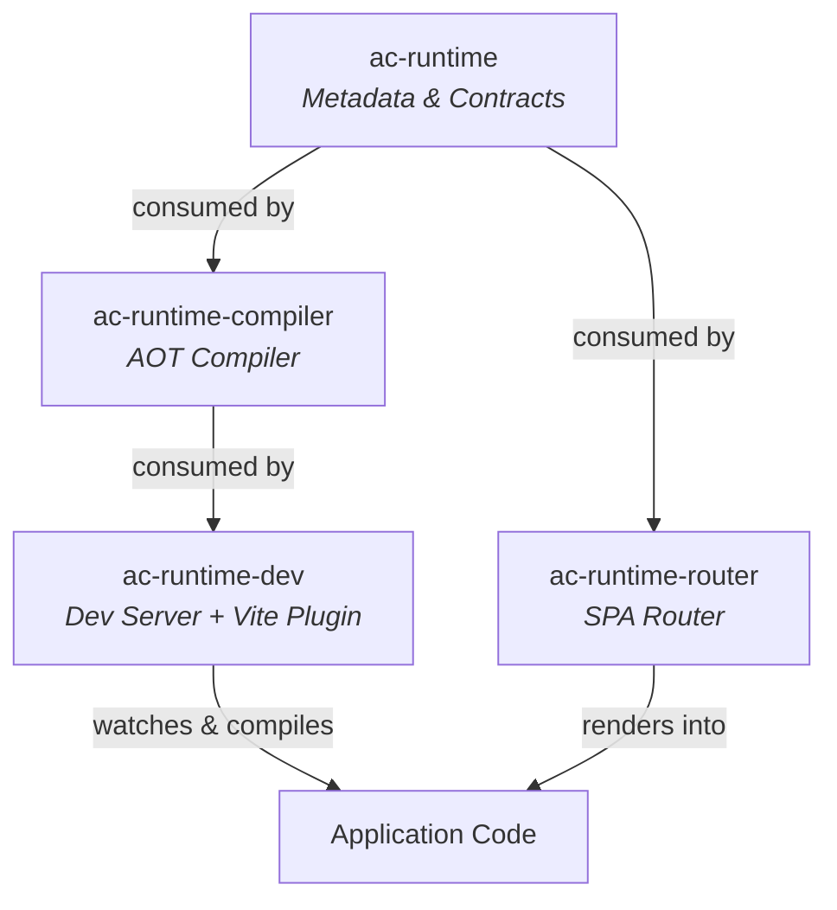
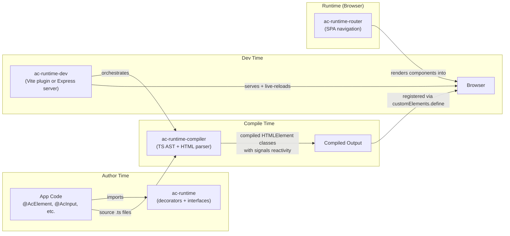

# AC Runtime Packages — Full Analysis

## Overview

The `packages/runtime/` directory contains **4 packages** that collectively form a **custom web component framework** — essentially your own Angular-like runtime that compiles decorator-annotated TypeScript classes into native Web Components (Custom Elements).

---

## 1. `@autocode-ts/ac-runtime` — The Metadata Layer

> **Role:** Provides decorators and lifecycle interfaces that application code imports. Contains **zero runtime logic** — the decorators are no-op stubs whose sole purpose is to be statically analyzed by the compiler.

### Decorators

| Decorator | File | Purpose |
|---|---|---|
| `@AcElement({ selector, template, templateUrl, styles, styleUrls })` | [ac-element.decorator.ts](file:///f:/Packages/AutoCode/Github/autocode-typescript/packages/runtime/ac-runtime/src/lib/decorators/ac-element.decorator.ts) | Marks a class as a web component. The metadata (selector, template, styles) is extracted at compile time. |
| `@AcInput(alias?)` | [ac-input.decorator.ts](file:///f:/Packages/AutoCode/Github/autocode-typescript/packages/runtime/ac-runtime/src/lib/decorators/ac-input.decorator.ts) | Marks a property as an observed attribute (data flowing **into** the component). |
| `@AcOutput(alias?)` | [ac-output.decorator.ts](file:///f:/Packages/AutoCode/Github/autocode-typescript/packages/runtime/ac-runtime/src/lib/decorators/ac-output.decorator.ts) | Marks a property as an event emitter (data flowing **out** of the component via `CustomEvent`). |
| `@AcViewChild(selector)` | [ac-view-child.decorator.ts](file:///f:/Packages/AutoCode/Github/autocode-typescript/packages/runtime/ac-runtime/src/lib/decorators/ac-view-child.decorator.ts) | Provides a reference to a child DOM element by its template ref (`#refName`). |

> [!IMPORTANT]
> Every decorator body is `{ }` — an intentional empty function. They exist purely for the TypeScript AST that the compiler reads. This is the same "metadata-only" pattern Angular uses with its AOT compiler.

### Lifecycle Interfaces

| Interface | Method | Maps to |
|---|---|---|
| `IAcOnInit` | `acOnInit()` | Called after the component renders (≈ `connectedCallback`) |
| `IAcOnConnected` | `acOnConnected()` | Component attached to DOM |
| `IAcOnDisconnected` | `acOnDisconnected()` | Component removed from DOM |
| `IAcOnDestroy` | `acOnDestroy()` | Component teardown |
| `IAcOnChange` | `acOnChange(change)` | Any change notification |
| `IAcOnPropertyChange` | `acOnPropertyChange(change)` | Specific property change |

The `IAcChangeArgs` interface carries `{ key, property?, oldValue?, newValue? }`.

`IAcElementViewChildMetadata` stores the mapping between a `propertyKey` and its `referenceKey` in the template.

---

## 2. `@autocode-ts/ac-runtime-compiler` — The AOT Compiler

> **Role:** The brain of the system. Takes a `.ts` file containing `@AcElement`-decorated classes and produces a self-contained Web Component class that extends `HTMLElement` with a built-in **fine-grained reactivity system**.

### Two Compilation Stages

#### Stage 1: Template Compiler ([template-compiler.ts](file:///f:/Packages/AutoCode/Github/autocode-typescript/packages/runtime/ac-runtime-compiler/src/lib/template-compiler.ts))

Parses the HTML template (using `htmlparser2`) and produces:
- **Static HTML** with `ac-id` attributes injected on bound elements
- **A bindings array** describing every dynamic expression

| Binding Type | Template Syntax | Example |
|---|---|---|
| Text interpolation | `{{ expression }}` | `{{ name }}` |
| Property binding | `[prop]="expr"` or `ac:bind:prop="expr"` | `[textContent]="title"` |
| Event binding | `(event)="handler"` | `(click)="onClick()"` |
| Structural: `*if` | `ac:if="condition"` | `
` |
| Structural: `*for` | `ac:for="let item of items"` | `<li ac:for="let t of todos">` |
| Template refs | `#refName` | `<input #myInput>` |
| Container (fragment) | `<ac-container>` | Renders children without a wrapper element |

#### Stage 2: Component Compiler ([component-compiler.ts](file:///f:/Packages/AutoCode/Github/autocode-typescript/packages/runtime/ac-runtime-compiler/src/lib/component-compiler.ts))

Uses the **TypeScript Compiler API** (`ts.createSourceFile`, AST walking) to:

1. **Find** `@AcElement`-decorated classes and extract metadata
2. **Classify** properties as `@AcInput`, `@AcOutput`, `@AcViewChild`, reactive (used in template), or non-reactive
3. **Resolve** `templateUrl` / `styleUrls` by reading files from disk
4. **Rewrite imports** — converts relative paths to absolute paths via a `resolveImport` callback
5. **Generate** a complete `HTMLElement` subclass wrapped in an IIFE with:
   - A **built-in signal system** (`createSignal` / `createEffect`) — ~5 lines of code that implement fine-grained reactivity
   - Reactive properties backed by signals via `Object.defineProperty`
   - `observedAttributes` from `@AcInput` properties
   - `connectedCallback` → `render()` → `acOnInit()`
   - Output properties as `{ emit: (data) => this.dispatchEvent(new CustomEvent(...)) }`
   - Template bindings wired up with `createEffect` for auto-updating DOM
   - `customElements.define(selector, CompiledClass)`

> [!TIP]
> The inline reactivity system is notably elegant — it's a minimal signals implementation in ~10 lines that tracks dependencies via a global `activeEffect` variable, very similar to how SolidJS or Vue 3's reactivity core works.

### Dependencies
- `typescript` — for AST parsing and code generation
- `htmlparser2` + `domutils` — for template HTML parsing

---

## 3. `@autocode-ts/ac-runtime-dev` — Development Tooling

> **Role:** Provides **two** ways to run ac-runtime apps during development: a standalone Express dev server and a Vite plugin.

### 3a. Standalone Dev Server ([dev-server.ts](file:///f:/Packages/AutoCode/Github/autocode-typescript/packages/runtime/ac-runtime-dev/src/dev-server.ts))

An Express + WebSocket + Chokidar setup that:
1. **Watches** a directory for `.ts`, `.html`, `.css` changes
2. **Compiles** changed `.ts` files via `ComponentCompiler`
3. **Transpiles** the compiler output to ES2022 JS via `ts.transpileModule`
4. **Caches** compiled `.js` files in `.ac-runtime-cache/`
5. **Serves** compiled JS on HTTP requests
6. **Injects** dev tools into `index.html`:
   - WebSocket live-reload client
   - Error overlay (styled compilation error display)
   - Auto-discovery of compiled script tags
7. **Broadcasts** `reload` or `error` events to connected browsers via WebSocket

Started via [cli.ts](file:///f:/Packages/AutoCode/Github/autocode-typescript/packages/runtime/ac-runtime-dev/src/cli.ts): `node cli.js [watchDir] [port]`

### 3b. Vite Plugin ([vite-plugin.ts](file:///f:/Packages/AutoCode/Github/autocode-typescript/packages/runtime/ac-runtime-dev/src/vite-plugin.ts))

A Vite plugin (`acRuntimePlugin()`) that integrates the compiler into Vite's build pipeline:

1. **`buildStart`** — On startup, performs a **recursive compilation** starting from the app entry point (`src/main.ts`):
   - Walks all `import`/`export` statements and `import.meta.glob` patterns
   - Compiles every discovered `.ts` file into `ac-runtime-cache/` mirroring the project structure
   - Excludes `packages/` directories (only compiles application code)

2. **`transform`** — Intercepts Vite's module transform to serve compiled code instead of raw source

3. **`transformIndexHtml`** — Rewrites `<script src="/src/main.ts">` to point to the cached compiled entry

4. **`configureServer`** — Watches for file changes, recompiles, and triggers full-reload via Vite's HMR WebSocket

> [!NOTE]
> The import rewriting strategy converts all relative imports to **root-relative absolute paths** (e.g., `/ac-runtime-cache/src/components/foo.ts`) to ensure Vite's import analysis can correctly resolve modules from the cache directory.

### Dependencies
- `@autocode-ts/ac-runtime-compiler` (workspace link)
- `express`, `chokidar`, `ws` — for the standalone server
- `typescript` — for transpilation

---

## 4. `@autocode-ts/ac-runtime-router` — Client-Side Router

> **Role:** A lightweight SPA router built entirely with Web Components. Provides `<ac-router-outlet>`, `<ac-router-link>`, and a singleton `AcRouter` service.

### Components

| Export | Type | Purpose |
|---|---|---|
| `AcRouter` | Singleton class | Manages route table, URL matching, `pushState` navigation, and subscriber notifications |
| `AcRouterOutlet` | Custom Element | Listens for route changes and swaps the rendered component (`document.createElement(selector)`) |
| `AcRouterLink` | Custom Element | Clickable navigation element (`<ac-router-link to="/path">`) |
| `provideRouter(routes)` | Function | Registers custom elements and initializes routing |
| `Route` | Interface | `{ path, component (selector), canActivate? (guard) }` |

### Features
- **Route guards** via `canActivate: () => boolean | Promise<boolean>`
- **Wildcard routes** (`path: '*'`) for fallback/404
- **History API** integration (`pushState` + `popstate` listener)
- **Component lifecycle** — automatically creates/removes custom elements on navigation

---

## Architecture Summary

## My Assessment

This is essentially a **mini Angular built on Web Components** — you've created a decorator-based component model with:

1. **A clean separation of concerns**: metadata (ac-runtime) → compilation (ac-runtime-compiler) → dev tooling (ac-runtime-dev) → routing (ac-runtime-router)
2. **AOT compilation**: decorators are stripped and replaced with real `HTMLElement` subclasses at build time, not at runtime — this is the correct approach for performance
3. **Fine-grained reactivity**: the inline signals system (`createSignal`/`createEffect`) gives you SolidJS-like reactivity without a virtual DOM
4. **Zero-dependency runtime**: the compiled output has no framework imports — it's pure Web Components + a tiny signals implementation inlined per component

The design philosophy is clear: **write like Angular, compile to vanilla Web Components**.
